# CaseLabs SMA8-A Custom Watercooled PC Build

A dream build years in the making, a custom dual-loop watercooled PC built inside one of the last CaseLabs SMA8-A cases ever produced. This repo contains the CAD designs, CNC G-code files, 3D print files, and photos for the project.

<!-- Hero shot of the completed build -->
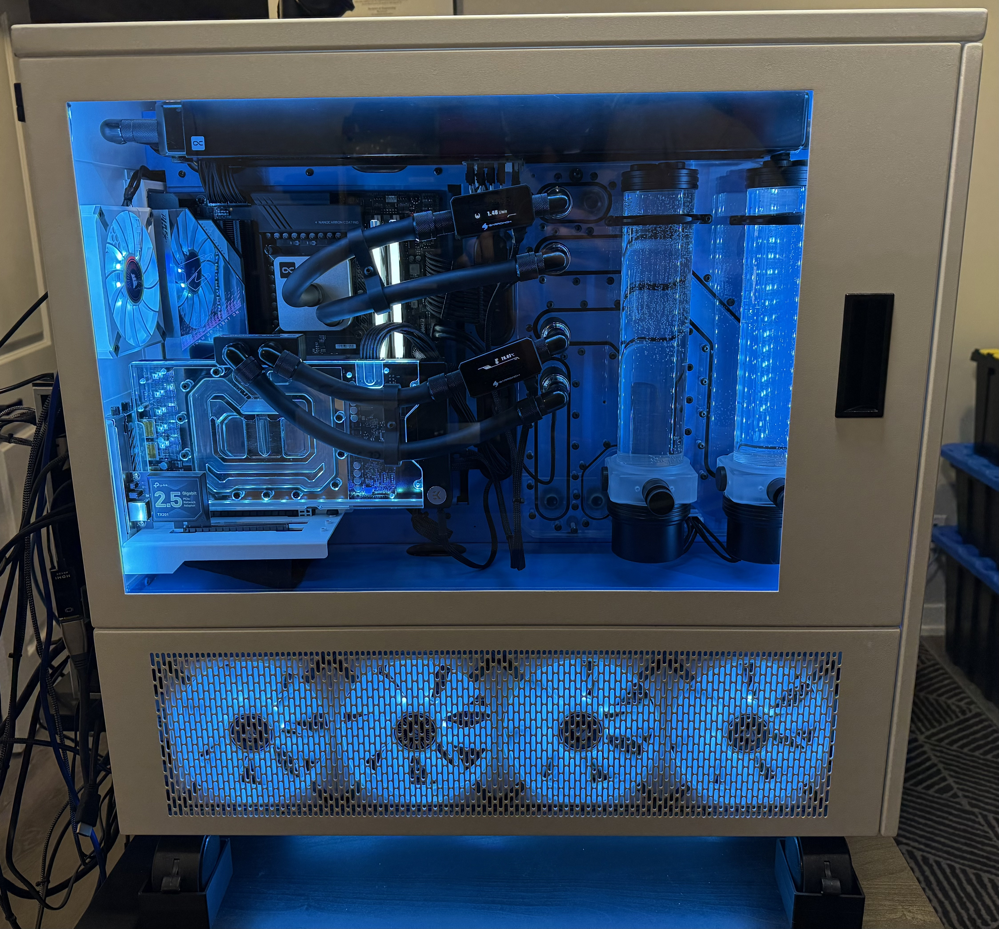

## Background

[CaseLabs](https://www.caselabs.net/) was a boutique case manufacturer that made high-quality, modular cases designed specifically for watercooling enthusiasts. They shut down in 2018 due to aluminum tariffs. The SMA8-A was one of their flagship full-tower cases, extremely modular, easy to mod, and built to last.

This particular case was acquired secondhand in a dual white and blue colorway, one of the very last produced. It was previously used in the ["Untouchable Build"](https://www.youtube.com/watch?v=2Ot4zZOUVVg) by DazMode. After four years of planning, the build was completed in 2024.

<!-- The case before the build / unboxing shot -->
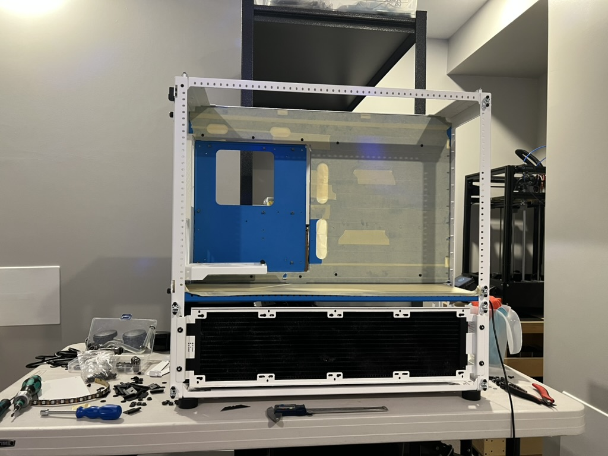

## Build Philosophy

The core design principle: **make the build highly capable and equipped, while allowing hardware upgrades without needing new mods.**

This is achieved through two key components:

- **Custom CNC water distribution plate**: A two-piece acrylic distro plate designed in Fusion360 and cut on an MPCNC. It hosts dual Singularity Computers Protium pump/reservoir combos and provides fixed inlet/outlet ports for both the CPU and GPU loops. Since the ports are in fixed positions, hardware can be swapped without redesigning any watercooling routes.

- **Elmorlabs PMD2**: Acts as a breakout board between the PSU's stock cables (rear side) and clean sleeved cables (front side). This means the PSU, motherboard, or GPU can be swapped without redoing all the custom cabling.

<!-- Front side showing clean tubing and sleeved cables -->
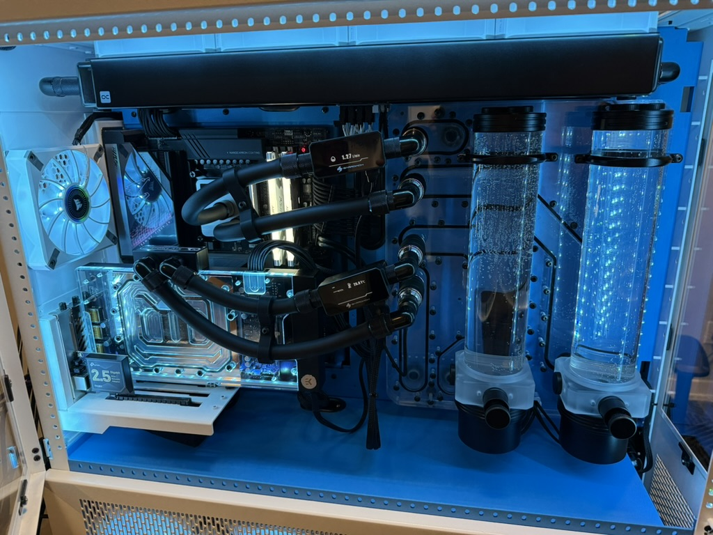

<!-- Rear side showing hard tubing and PMD2 wiring -->
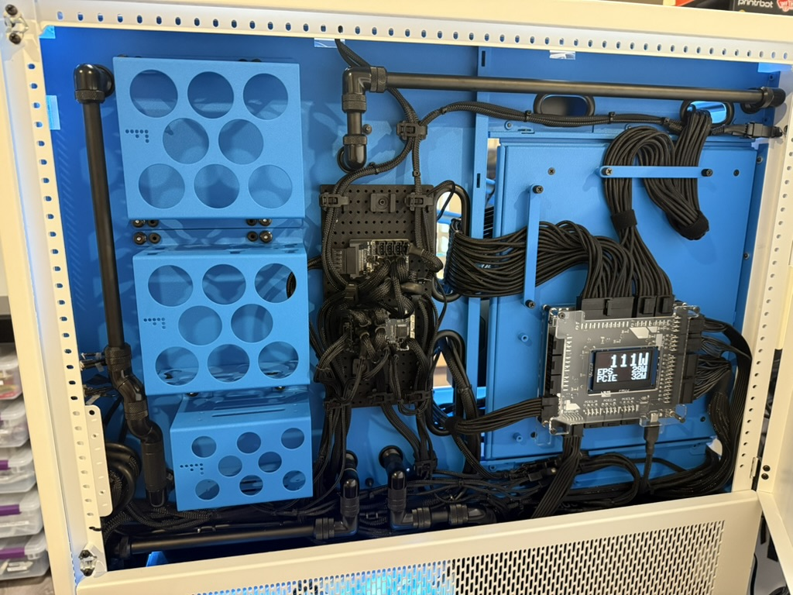

## Build Highlights

| Component | Details |
|---|---|
| **Case** | CaseLabs SMA8-A (White/Blue) |
| **Cooling** | Dual loop — CPU + GPU with separate pump/res combos |
| **Radiators** | 1x 480mm (CPU, top), 1x 520mm + 1x 240mm (GPU, basement) |
| **Distribution Plate** | Custom CNC'd dual-layer acrylic with G1/4 ports and O-ring seal |
| **Reservoirs** | 2x Singularity Computers Protium pump/res combos |
| **Tubing** | Soft tubing (front/basement) for serviceability, black brass hard tubing (rear) for aesthetics |
| **Quick Disconnects** | On each CPU and GPU inlet/outlet for tool-less maintenance |
| **Fan/RGB Controller** | Aquacomputer OCTO + Splitty RGB |
| **Power Distribution** | Elmorlabs PMD2 |
| **Monitoring** | Flow rate and temperature gauges, Aquacomputer sensors |

## Repo Structure

```
caselabs-sma8-a/
├── README.md
├── cad/                                     # Fusion360 CAD files and exports
├── 3d-prints/                               # 3D print files
├── photos/                                  # Build photos
└── gcode/
    ├── Main Distro gcode/                   # G-code for the final distribution plate
    │   ├── Main Distro Front Bore.gcode
    │   ├── Main Distro Front Contour.gcode
    │   └── Main Distro Front Pocket and Bore.gcode
    ├── test acrylic gcode/                  # G-code for test cuts on acrylic
    │   ├── Front Contour.gcode
    │   ├── Front M4 Bore.gcode
    │   ├── Front Pocket and Bore.gcode
    │   ├── Rear Bore.gcode
    │   ├── Rear Contour.gcode
    │   ├── Rear Oring.gcode
    │   └── Rear Pocket.gcode
    └── Drill plate gocde/                   # G-code for the drill alignment plate
        └── Drill Plate.gcode
```

### `cad/`

Fusion360 design files for the water distribution plate, case mods, and any other custom parts. Includes source `.f3d` files and exported formats like `.step` or `.dxf`.

### `3d-prints/`

STL mesh files for 3D-printed parts such as the Aquacomputer OCTO mounting bracket, cable management grid mounts, and any other custom brackets.

### `photos/`

Build photos documenting the project, in-progress shots, completed build, and detail shots of the distro plate, watercooling routes, and wiring.

### `gcode/`

CNC G-code files for the custom water distribution plate, generated from Fusion360 CAM and run on an MPCNC. The distro plate is made from two acrylic sheets CNC'd with pockets, G1/4 threaded bore holes, and O-ring channels, then sandwiched together with M4 screws to create a watertight seal.

- **Main Distro gcode/** Final production G-code for the front face of the distribution plate (contour cuts, bore holes, pockets).
- **test acrylic gcode/** Test cuts used to dial in feeds, speeds, and tolerances on acrylic before cutting the final piece. Includes both front and rear operations (contours, bores, pockets, O-ring channels, M4 mounting holes).
- **Drill plate gocde/** G-code for a drill alignment plate used during assembly.

## How the Distro Plate Works

The distribution plate is a two-piece acrylic sandwich:

1. **Front sheet**: Hosts the dual reservoirs and four G1/4 ports (CPU in/out, GPU in/out) on the visible side of the case.
2. **Rear sheet**: Has four G1/4 ports (pump/res in/out for each loop) that connect through the case's mid panel via panel fittings.

Internal channels are created by CNC'ing pockets into both faces. When the sheets are compressed together with M4 screws, O-rings between them seal the channels, routing water between the front ports and rear ports without any external tubing.

<!-- Distro plate front face with reservoirs mounted -->
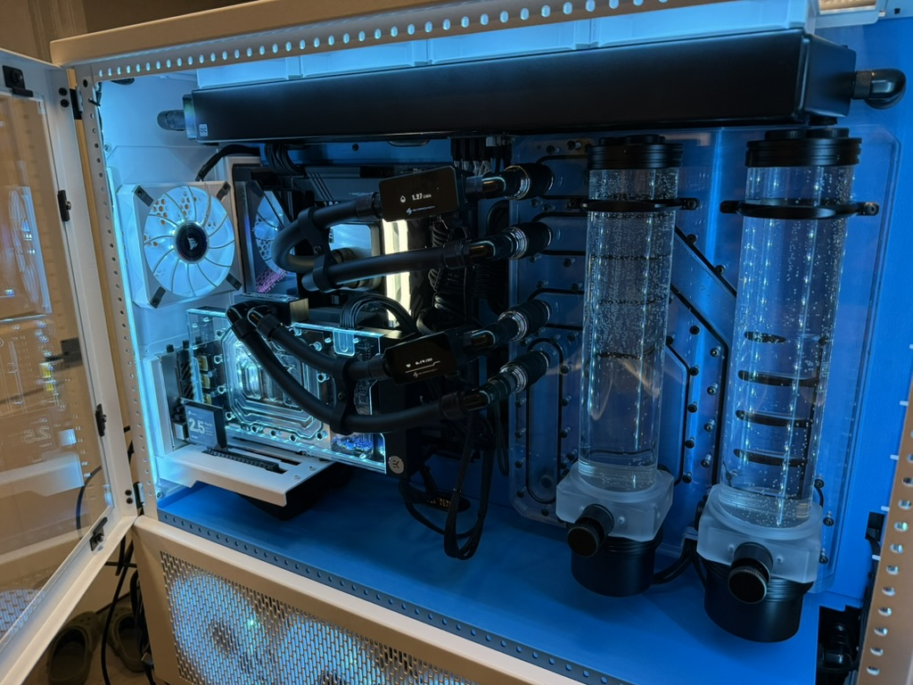

<!-- Distro plate rear face showing hard tubing connections -->
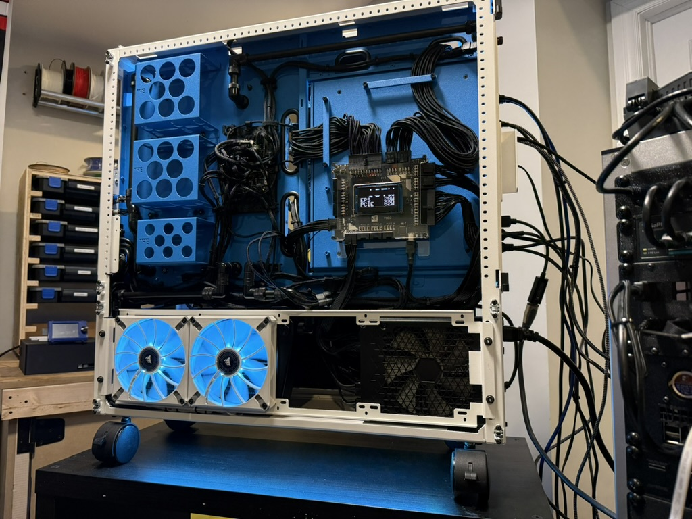

<!-- Fusion360 CAD screenshot of the distro plate design -->
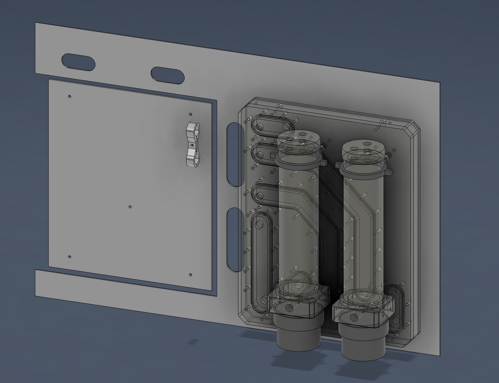

<!-- CNC cutting the acrylic on the MPCNC -->
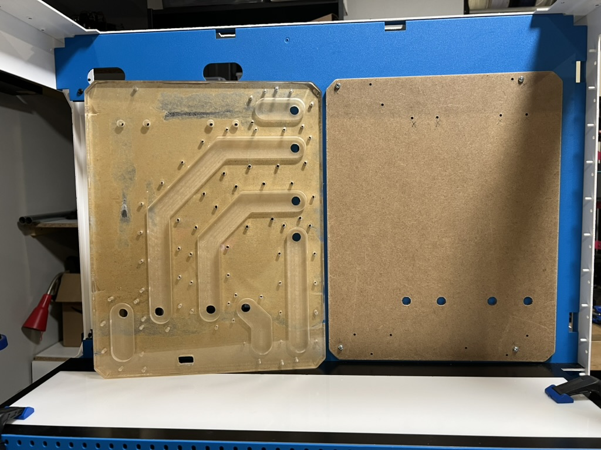

<!-- Basement showing radiators and soft tubing -->
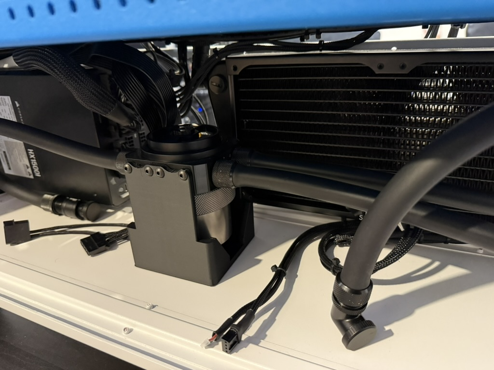

<!-- Aquacomputer OCTO on the custom 3D-printed bracket -->
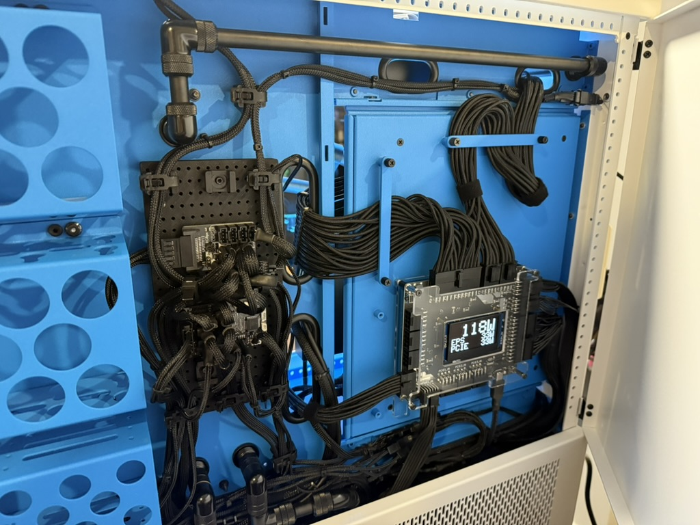

<!-- PMD2 wiring on the rear side -->
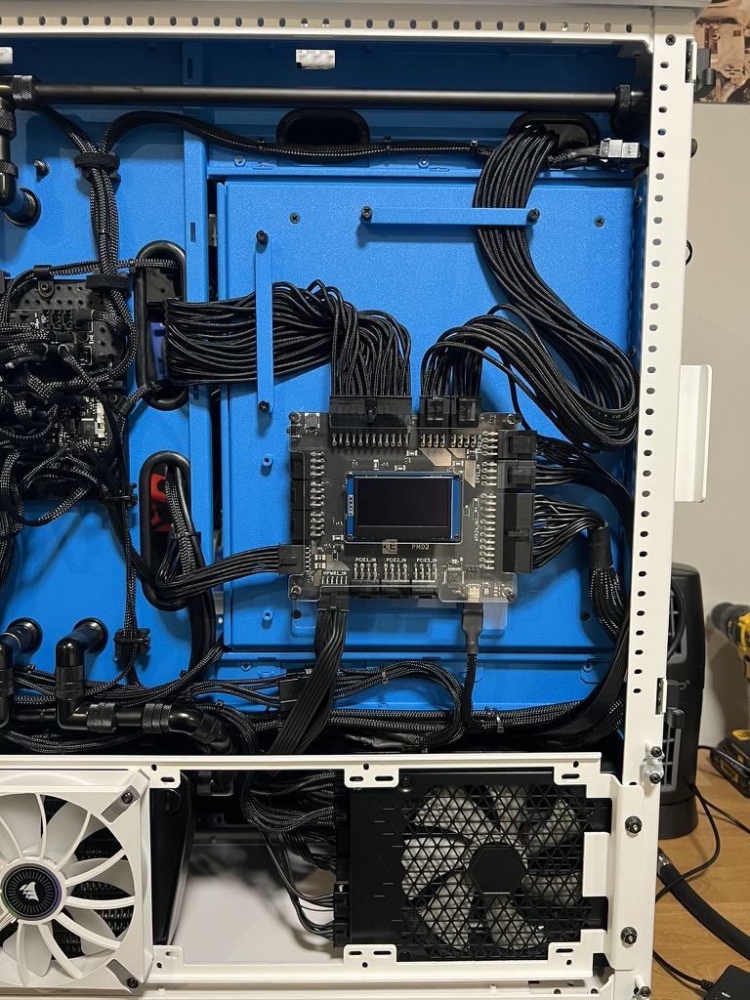

## Inspiration

- [Singularity Computers](https://www.youtube.com/@SingularityComputers): The channel that started it all
- [DaxMode "Untouchable Build"](https://www.youtube.com/watch?v=2Ot4zZOUVVg): The previous life of this case
